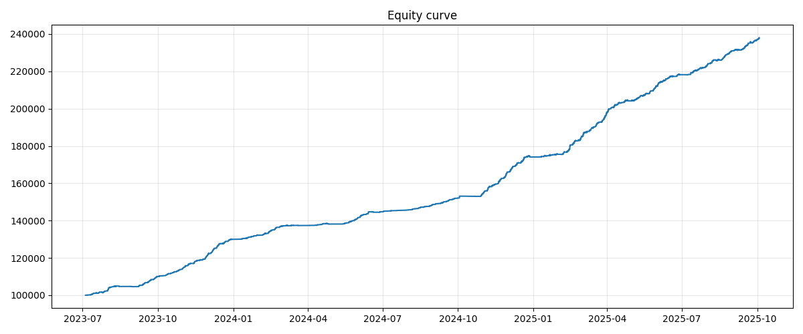
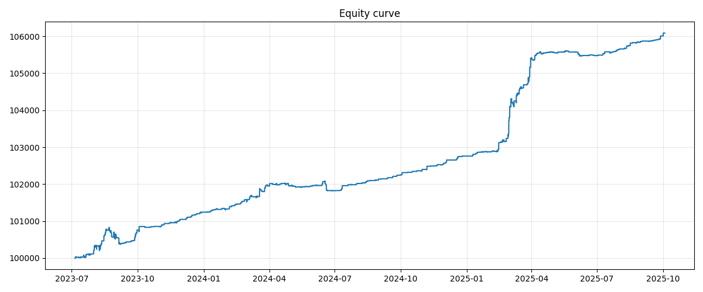

# About the strategy
The is a classic spread mean-reversion strategy for cointegrated assets. Just for certainty I used SBER and SBERP traiding pairs from MOEX. 

A simple linear model is used:
Price(asset1) = a * Price(asset2) + b + E,  
where E is stationary and mean revearting.  
Linear regression is rolling with window spread_window, which is one of the optimizaed parameters. 

Then the rolling Z-score is calculated for E = a * Price(asset1) - Price(asset2) - b  
Z-score window is another optimized parameter

Entry conditions:  
If z > z_entry: short a * SBER and long SBERP  
If z < -z_entry: short SBERP and long a * SBERP

Exit conditions:  
z <= z_exit  
z >= z_exit  

Walk forward optimization is performed using optuna.  
Fees and included in the model, but not the slippage.

# Walk-Forward Optimization Results
Initial balance for each following tests is 100 000 and position sizes are calculated using Kelly criterion. 
## 0.008% fee (too optimistic)
Annialized return is 47% 

| train_start   | train_end   | test_start   | test_end   |   annualized_return_% |   profit_% |   absolute_profit |   total_trades |   win_ratio_% |   avg_holding_hours |   max_pnl |   min_pnl |   avg_pnl |   paid_fees |   z_entry |    z_exit |   sl_pct |   spread_window |   z_window |
|:--------------|:------------|:-------------|:-----------|----------------------:|-----------:|------------------:|---------------:|--------------:|--------------------:|----------:|----------:|----------:|------------:|----------:|----------:|---------:|----------------:|-----------:|
| 2023-01-03    | 2023-07-03  | 2023-07-03   | 2023-10-03 |                  49.1 |       10.3 |             10339 |           1060 |          62.5 |                 0.5 |     378.5 |    -116.1 |      21.1 |     11999   |   1.82962 | 0.358245  |     31.3 |             915 |        111 |
| 2023-04-03    | 2023-10-03  | 2023-10-03   | 2024-01-03 |                  95.8 |       17.8 |             19621 |           1154 |          92.1 |                 0.5 |     258.6 |    -131.1 |      35.5 |     21334.3 |   1.64196 | 0.0219078 |     42.1 |            1181 |        148 |
| 2023-07-03    | 2024-01-03  | 2024-01-03   | 2024-04-03 |                  25.7 |        5.7 |              7458 |            929 |          65.9 |                 0.7 |     318.9 |    -124.5 |      22.8 |     13737.7 |   1.73074 | 0.0739916 |     16.7 |            1012 |        128 |
| 2023-10-03    | 2024-04-03  | 2024-04-03   | 2024-07-03 |                  24.9 |        5.6 |              7664 |            740 |          70.7 |                 1.2 |     708.9 |    -163.2 |      27   |     12348   |   1.84945 | 0.0278607 |     30   |            1052 |        137 |
| 2024-01-03    | 2024-07-03  | 2024-07-03   | 2024-10-03 |                  24.4 |        5.5 |              8016 |            193 |          92.2 |                 0.6 |     492.1 |     -84.2 |      60.6 |      3685.3 |   2.95982 | 0.172055  |     46.4 |             887 |        156 |
| 2024-04-03    | 2024-10-03  | 2024-10-03   | 2025-01-03 |                  68.3 |       13.7 |             20962 |           1472 |          68.3 |                 0.7 |     730.6 |    -512.3 |      33.5 |     28382.4 |   1.39962 | 0.0945404 |     40   |             907 |        178 |
| 2024-07-03    | 2025-01-03  | 2025-01-03   | 2025-04-03 |                  80.1 |       14.9 |             25870 |           1428 |          75.8 |                 0.5 |    1385.6 |    -211   |      43.5 |     36216.5 |   1.73614 | 0.258994  |      6.7 |             869 |        130 |
| 2024-10-03    | 2025-04-03  | 2025-04-03   | 2025-07-03 |                  43.2 |        9.1 |             18272 |           1244 |          69.9 |                 0.9 |     421.6 |    -378.8 |      41.9 |     33850.3 |   1.65079 | 0.115226  |     11.1 |             811 |        183 |
| 2025-01-03    | 2025-07-03  | 2025-07-03   | 2025-10-03 |                  42.2 |        9.1 |             19768 |            724 |          86.5 |                 1.1 |     483.1 |    -329.9 |      61   |     24362.4 |   2.04786 | 0.122184  |      4.9 |             951 |        192 |

## 0.02% fee
Annialized return is only 2.7%

| train_start   | train_end   | test_start   | test_end   |   annualized_return_% |   profit_% |   absolute_profit |   total_trades |   win_ratio_% |   avg_holding_hours |   max_pnl |   min_pnl |   avg_pnl |   paid_fees |   z_entry |   z_exit |   sl_pct |   spread_window |   z_window |
|:--------------|:------------|:-------------|:-----------|----------------------:|-----------:|------------------:|---------------:|--------------:|--------------------:|----------:|----------:|----------:|------------:|----------:|---------:|---------:|----------------:|-----------:|
| 2023-01-03    | 2023-07-03  | 2023-07-03   | 2023-10-03 |                   3.5 |        0.9 |               853 |            190 |          90.5 |                 1.2 |     179   |     -81.1 |      28.1 |      4484.2 |   2.92749 | 0.227439 |     21.6 |            1073 |        162 |
| 2023-04-03    | 2023-10-03  | 2023-10-03   | 2024-01-03 |                   1.6 |        0.4 |               389 |             42 |          92.9 |                 0.2 |      45   |     -12   |      19.2 |       419.6 |   4.52923 | 0.97401  |     48.9 |             838 |        111 |
| 2023-07-03    | 2024-01-03  | 2024-01-03   | 2024-04-03 |                   3.2 |        0.8 |               775 |             75 |          94.7 |                 0.2 |     254.7 |     -19.5 |      30.5 |      1515.7 |   3.75253 | 1.03159  |     17.3 |             810 |        200 |
| 2023-10-03    | 2024-04-03  | 2024-04-03   | 2024-07-03 |                  -0.8 |       -0.2 |              -190 |             89 |          78.7 |                 0.3 |     102.3 |    -105.6 |       8.1 |       915.2 |   3.63932 | 0.520623 |     42.8 |            1114 |        112 |
| 2024-01-03    | 2024-07-03  | 2024-07-03   | 2024-10-03 |                   2   |        0.5 |               486 |             27 |          96.3 |                 1   |      94.3 |      -0.3 |      28.1 |       272.4 |   4.92358 | 0.105184 |     10.7 |            1197 |        133 |
| 2024-04-03    | 2024-10-03  | 2024-10-03   | 2025-01-03 |                   1.8 |        0.4 |               447 |             30 |         100   |                 0.2 |      97.2 |       0.3 |      25   |       304.6 |   4.30542 | 2.49378  |     48.4 |             892 |        170 |
| 2024-07-03    | 2025-01-03  | 2025-01-03   | 2025-04-03 |                  11.5 |        2.5 |              2597 |            111 |          89.2 |                 0.3 |     398.5 |     -51.5 |      50.8 |      3047.7 |   3.64771 | 0.925821 |     35   |            1115 |        179 |
| 2024-10-03    | 2025-04-03  | 2025-04-03   | 2025-07-03 |                   0.5 |        0.1 |               135 |             79 |          87.3 |                 0.1 |      56.6 |     -16.2 |      11.7 |       792.1 |   3.88681 | 1.75162  |     22.2 |            1165 |        125 |
| 2025-01-03    | 2025-07-03  | 2025-07-03   | 2025-10-03 |                   2.3 |        0.6 |               597 |             52 |          94.2 |                 0.3 |     121.1 |      -7.6 |      23.2 |       607.4 |   4.27774 | 0.728726 |     23.4 |            1066 |        195 |

## Conlcusion

With fee rates available to a retail trader the strategy performs poorly and definately is not worth trading live. 

## Possible improvements in the code 

1) Having two seperate backtest functions where one is used to maximize execution speed while optimizing parameters and another for out of sample tests seemed like a great idea in the beginning, but quickly turned into a nightmare because of all the duplicate lines of code. I am never again using this approach.
2) Slippage was not modeled at all, but it obviously would only make a strategy worse.
3) Overall optimization speed is really bad and the bottle neck here is rolling OLS from statmodels. Rewriting it only using numpy would probably speed up things.
4) In future projects I will try to avoid using cycles with price series and instead use vectored calculations.
5) It would be also interesting to use Kalman filter instead of rolling OLS. 

## Data link
https://drive.google.com/drive/folders/1xzjAMPlM7wVLiC6kKs2LmQLJY_RqKXiN?usp=sharing

