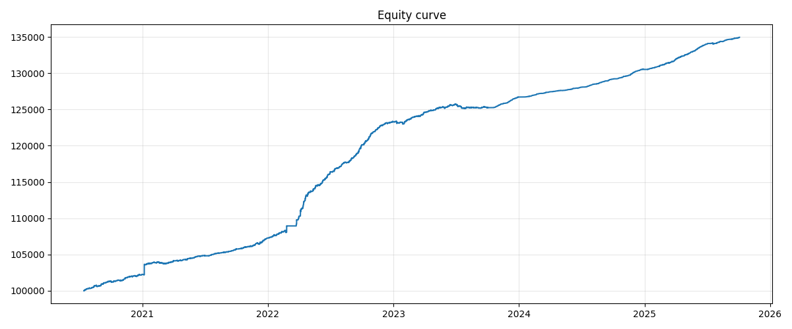
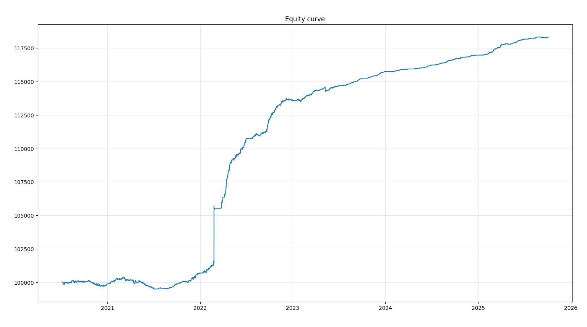

# About the strategy
The is a classic spread mean-reversion strategy for cointegrated assets. Just for certainty I used SBER and SBERP traiding pairs from MOEX. 

A simple linear model is used:
Price(asset1) = a * Price(asset2) + b + E,  
where E is stationary and mean revearting.  
Linear regression is rolling with window spread_window, which is one of the optimizaed parameters. 

Then the rolling Z-score is calculated for E = a * Price(asset1) - Price(asset2) - b  
Z-score window is another optimized parameter

Entry conditions:  
If z > z_entry: short a * SBER and long SBERP  
If z < -z_entry: short SBERP and long a * SBERP

Exit conditions:  
z <= z_exit  
z >= z_exit  

Walk forward optimization is performed using optuna.  
Fees and included in the model, but not the slippage.

# Difference in all the code versions
As for now all new versions inherit features from previous ones with some added functionality. 

Version 1 (strategy_optimization.py) is the most basic and only has 3 hyperparameters to optimizes and fixed allocation for eatch trade. 

Version 2 has 5 hyperramaters and still a fixed allocation for trades. 

Version 3 uses Kelly criterion to calculate position sizes.

Version 4: look-ahead bias is fixed. Since this moment versions 1,2,3 are no longer getting updates and their performance is not realistic. 

**Important:** All three versions used to have a slight look-ahead bias that was fixed only roughly and will be fixed thoroughly in version 4. 

# Preliminary results and what shall be improved 
Strategy seems to be profitable and stable enough for furher research, but a lot of things are yet to be reworked. 

Currenly returns are calculated relative to the balance and since the strategy consistenly generates profit without major drawdowns the 100% allocation for each trade would be superior. However, that probably does not reppresent reality well enough. 

Because of that, it's really hard to tell returns of the strategy as it heavily depends on the RISK_PCT. With 10% allocation for each trade we are possibly looking for around 5-10% annualy, but for 100% the numbers are around 40-50% anually.

Therefore, it would be great to calculate returns relative to the capital at risk and not just on the plain balance. 

Sharpe ratio estimation is as well may not be realistic as returns are now only updated when the positions are closed and so the volatility could be underestimated

Slippage is also not included in the backtest. 

**Update**:  in version 3 position size is now calculated using Kelly criterion so the balance problem is solved for now. Also Sharp ratio has been fixed in all versions.  
However, I have found a possible look-ahead bias in all of the versions and have fixed it roughly. So the perforamnce of all the versions is likely to be underestimeated.  
It will be fixed in the 4th version and all the previous versions will probably be retired completely. 

**Update2**   With version 4 all the major problems seem to have benn solved. However, the code is pretty slow and I have a couple ideas how to speed it up:  
1) Get rid of statmodels OLS and write a custom analogue using numpy and optuna
2) Alternatively use Kalman filter instead of rolling OLS

# Walk-Forward Optimization Results (outdated)
Initial balance for each following tests is 100 000 and 10% of the balance is used for trades. 
## 10 mintues timeframe, 0.008% fee
Annialized return is 5.9% 

Sharpe ratio is 0.7
| train_start   | train_end   | test_start   | test_end   |   annualized_return_% |   profit_% |   absolute_profit |   total_trades |   win_ratio_% |   avg_holding_hours |   max_pnl |   min_pnl |   avg_pnl |   paid_fees |   z_threshold |   spread_window |   z_window |
|:--------------|:------------|:-------------|:-----------|----------------------:|-----------:|------------------:|---------------:|--------------:|--------------------:|----------:|----------:|----------:|------------:|--------------:|----------------:|-----------:|
| 2020-01-03    | 2020-07-03  | 2020-07-03   | 2020-10-03 |                   5.6 |        1.2 |              1194 |            729 |          76.1 |                 1.8 |      61.5 |    -102.4 |       3.2 |      1148.6 |      0.784295 |             638 |          9 |
| 2020-04-03    | 2020-10-03  | 2020-10-03   | 2021-01-03 |                   4.6 |        1   |              1062 |            239 |          70.7 |                 7.4 |      79.9 |     -96.9 |       6   |       380.4 |      0.680146 |             102 |         61 |
| 2020-07-03    | 2021-01-03  | 2021-01-03   | 2021-04-03 |                   7.8 |        1.8 |              1875 |            946 |          67.5 |                 1   |    1416.4 |     -44.8 |       3.6 |      1531.6 |      1.09893  |              10 |          5 |
| 2020-10-03    | 2021-04-03  | 2021-04-03   | 2021-07-03 |                   2.8 |        0.7 |               686 |            376 |          73.7 |                 4.3 |     111.4 |     -48.2 |       3.4 |       611.2 |      0.472342 |              53 |        112 |
| 2021-01-03    | 2021-07-03  | 2021-07-03   | 2021-10-03 |                   3.9 |        0.9 |               939 |            368 |          79.9 |                 4.2 |      25.3 |     -30.9 |       4.2 |       602.4 |      1.0709   |             282 |         26 |
| 2021-04-03    | 2021-10-03  | 2021-10-03   | 2022-01-03 |                   6.3 |        1.5 |              1541 |            279 |          76.7 |                 4.9 |     163.3 |     -84.5 |       7.2 |       461.2 |      1.15475  |             310 |         37 |
| 2021-07-03    | 2022-01-03  | 2022-01-03   | 2022-04-03 |                  12.4 |        2.8 |              2999 |            201 |          74.6 |                 1.6 |     872.1 |    -171.2 |      16.6 |       339.1 |      1.46118  |              15 |        143 |
| 2021-10-03    | 2022-04-03  | 2022-04-03   | 2022-07-03 |                  25.3 |        5.5 |              6094 |            485 |          80.4 |                 3.4 |     201.6 |    -167   |      14.4 |       874.8 |      0.411996 |              40 |         20 |
| 2022-01-03    | 2022-07-03  | 2022-07-03   | 2022-10-03 |                  14   |        3.2 |              3741 |            605 |          81.8 |                 2.6 |     188.5 |     -83.7 |       8.1 |      1130.5 |      0.776474 |             149 |         11 |
| 2022-04-03    | 2022-10-03  | 2022-10-03   | 2023-01-03 |                  11.1 |        2.6 |              3129 |            692 |          82.4 |                 1.9 |     128.7 |     -62.2 |       6.5 |      1339.5 |      0.780238 |             166 |         13 |
| 2022-07-03    | 2023-01-03  | 2023-01-03   | 2023-04-03 |                   4.5 |        1.1 |              1341 |            746 |          77.2 |                 1.6 |      89.9 |    -256.6 |       3.8 |      1456.8 |      0.72375  |              10 |         71 |
| 2022-10-03    | 2023-04-03  | 2023-04-03   | 2023-07-03 |                   3.7 |        0.9 |              1118 |            726 |          77.3 |                 1.9 |     128   |     -70.4 |       3.5 |      1427.6 |      0.746702 |              17 |         20 |
| 2023-01-03    | 2023-07-03  | 2023-07-03   | 2023-10-03 |                  -1.5 |       -0.4 |              -471 |           1403 |          72.2 |                 1   |     117.7 |    -166.6 |       1.6 |      2755.3 |      0.409599 |              10 |          6 |
| 2023-04-03    | 2023-10-03  | 2023-10-03   | 2024-01-03 |                   5.8 |        1.2 |              1462 |            337 |          97.9 |                 3.5 |      23.8 |     -10.4 |       6.3 |       664.5 |      1.11241  |             992 |         53 |
| 2023-07-03    | 2024-01-03  | 2024-01-03   | 2024-04-03 |                   2.9 |        0.6 |               734 |            431 |          94.4 |                 3.4 |      50.2 |     -14.3 |       3.7 |       857.7 |      0.59174  |             962 |         41 |
| 2023-10-03    | 2024-04-03  | 2024-04-03   | 2024-07-03 |                   2.2 |        0.5 |               644 |            356 |          89.6 |                 4.5 |      25.3 |     -11.5 |       3.8 |       709.6 |      0.806328 |             243 |         57 |
| 2024-01-03    | 2024-07-03  | 2024-07-03   | 2024-10-03 |                   3.9 |        0.9 |              1128 |            269 |          93.3 |                 5.8 |      30.8 |      -8.9 |       6.2 |       541.7 |      0.613882 |             335 |        243 |
| 2024-04-03    | 2024-10-03  | 2024-10-03   | 2025-01-03 |                   4.5 |        1   |              1296 |            327 |          96.9 |                 4   |      49.2 |     -32.3 |       6   |       666.2 |      0.689393 |             357 |        184 |
| 2024-07-03    | 2025-01-03  | 2025-01-03   | 2025-04-03 |                   5.2 |        1.1 |              1498 |            667 |          85.5 |                 2   |      52.9 |     -17.3 |       4.3 |      1367   |      1.01727  |             275 |         16 |
| 2024-10-03    | 2025-04-03  | 2025-04-03   | 2025-07-03 |                   6.6 |        1.6 |              2083 |            647 |          90.1 |                 2.5 |      45.8 |     -25.6 |       5.3 |      1345.4 |      0.784313 |              85 |         53 |
| 2025-01-03    | 2025-07-03  | 2025-07-03   | 2025-10-03 |                   2.8 |        0.6 |               857 |            499 |          86.8 |                 2.9 |      30   |    
-148.4 |       3.8 |      1049.2 |      0.714931 |              66 |        696 |

## 10 mintues timeframe, 0.02% fee
Annialized return is 3.26%

Sharpe ratio is 0.2
| train_start   | train_end   | test_start   | test_end   |   annualized_return_% |   profit_% |   absolute_profit |   total_trades |   win_ratio_% |   avg_holding_hours |   max_pnl |   min_pnl |   avg_pnl |   paid_fees |   z_threshold |   spread_window |   z_window |
|:--------------|:------------|:-------------|:-----------|----------------------:|-----------:|------------------:|---------------:|--------------:|--------------------:|----------:|----------:|----------:|------------:|--------------:|----------------:|-----------:|
| 2020-01-03    | 2020-07-03  | 2020-07-03   | 2020-10-03 |                   0.3 |        0.1 |                68 |            274 |          70.1 |                 4.8 |      61.4 |     -93.3 |       4.2 |      1072.4 |      1.2246   |              42 |         53 |
| 2020-04-03    | 2020-10-03  | 2020-10-03   | 2021-01-03 |                  -0.8 |       -0.2 |              -179 |            127 |          67.7 |                 9.2 |     100.6 |     -96.3 |       2.5 |       496.7 |      0.834139 |              75 |        569 |
| 2020-07-03    | 2021-01-03  | 2021-01-03   | 2021-04-03 |                   1.3 |        0.3 |               296 |            236 |          73.3 |                 4.9 |     102.3 |     -75   |       5.2 |       920.2 |      1.02741  |              99 |         66 |
| 2020-10-03    | 2021-04-03  | 2021-04-03   | 2021-07-03 |                  -2.8 |       -0.7 |              -683 |            447 |          69.8 |                 2.7 |     177.3 |    -106.1 |       2.3 |      1732.2 |      0.91542  |              19 |         45 |
| 2021-01-03    | 2021-07-03  | 2021-07-03   | 2021-10-03 |                   1.9 |        0.4 |               404 |             64 |          85.9 |                 9.9 |      33.9 |     -32.1 |      10.2 |       247.4 |      1.50482  |             163 |        633 |
| 2021-04-03    | 2021-10-03  | 2021-10-03   | 2022-01-03 |                   3.4 |        0.8 |               788 |            141 |          77.3 |                 6.6 |      98.7 |     -76.2 |       9.5 |       546.7 |      1.80796  |             220 |         49 |
| 2021-07-03    | 2022-01-03  | 2022-01-03   | 2022-04-03 |                  28.4 |        5.6 |              5672 |            105 |          77.1 |                 4.5 |    3236.7 |    -285.6 |      58   |       414.4 |      1.53572  |             458 |         55 |
| 2021-10-03    | 2022-04-03  | 2022-04-03   | 2022-07-03 |                  18.7 |        4.1 |              4379 |            466 |          82.6 |                 3.3 |     179.9 |     -80.5 |      13.7 |      2009.6 |      0.776783 |             103 |         10 |
| 2022-01-03    | 2022-07-03  | 2022-07-03   | 2022-10-03 |                   7.1 |        1.4 |              1521 |            663 |          83.1 |                 2   |     198.6 |    -101.1 |       6.7 |      2916.8 |      0.440264 |             739 |          8 |
| 2022-04-03    | 2022-10-03  | 2022-10-03   | 2023-01-03 |                   4.8 |        1.2 |              1309 |            530 |          82.5 |                 3.1 |     136.1 |     -97.6 |       7   |      2375.1 |      0.594178 |              61 |         40 |
| 2022-07-03    | 2023-01-03  | 2023-01-03   | 2023-04-03 |                   3.2 |        0.7 |               776 |            452 |          88.9 |                 2.8 |      37.7 |     -25.2 |       6.2 |      2028.8 |      1.01727  |             565 |         20 |
| 2022-10-03    | 2023-04-03  | 2023-04-03   | 2023-07-03 |                   1.4 |        0.3 |               347 |            237 |          85.2 |                 5.1 |      51.7 |    -249.6 |       5.9 |      1063   |      0.659104 |             111 |        526 |
| 2023-01-03    | 2023-07-03  | 2023-07-03   | 2023-10-03 |                   2.3 |        0.5 |               555 |            173 |          96   |                 5.2 |      31.7 |     -18.1 |       7.7 |       779.7 |      1.44167  |             846 |         91 |
| 2023-04-03    | 2023-10-03  | 2023-10-03   | 2024-01-03 |                   2.1 |        0.4 |               491 |            238 |          99.2 |                 3.6 |      21.8 |      -9.5 |       6.6 |      1074.6 |      1.44926  |             895 |         58 |
| 2023-07-03    | 2024-01-03  | 2024-01-03   | 2024-04-03 |                   0.9 |        0.2 |               201 |            144 |          97.2 |                 6.9 |      27.2 |      -8.8 |       5.9 |       651.9 |      1.31919  |             965 |        121 |
| 2023-10-03    | 2024-04-03  | 2024-04-03   | 2024-07-03 |                   1.2 |        0.3 |               294 |             95 |          97.9 |                12   |      38.8 |      -5   |       7.6 |       429.1 |      1.24887  |             343 |        600 |
| 2024-01-03    | 2024-07-03  | 2024-07-03   | 2024-10-03 |                   1.8 |        0.4 |               471 |             95 |          95.8 |                 8.8 |      22.2 |      -4.4 |       9.5 |       431.4 |      1.45901  |             287 |        348 |
| 2024-04-03    | 2024-10-03  | 2024-10-03   | 2025-01-03 |                   0.9 |        0.2 |               270 |             23 |          95.7 |                 0.6 |      82.1 |      -7.5 |      16.3 |       104.8 |      3.64806  |              14 |         92 |
| 2024-07-03    | 2025-01-03  | 2025-01-03   | 2025-04-03 |                   3.3 |        0.7 |               800 |            184 |          94   |                 4.6 |      43.9 |     -11.7 |       8.9 |       839   |      1.62861  |             545 |         75 |
| 2024-10-03    | 2025-04-03  | 2025-04-03   | 2025-07-03 |                   1.5 |        0.3 |               393 |            124 |          92.7 |                 6.3 |      27.2 |     -22.7 |       7.8 |       569.5 |      1.45231  |             250 |        493 |
| 2025-01-03    | 2025-07-03  | 2025-07-03   | 2025-10-03 |                   0.6 |        0.1 |               161 |            246 |          92.7 |                 4.6 |      25.7 |     -11.4 |       5.3 |      1130.7 |      1.38363  |             997 |         79 |

## Data links

SBER https://drive.google.com/file/d/1HjTwX0ZIwoqtYKKdl5y3fG3rUgcYqZiT/view?usp=sharing

SBERP https://drive.google.com/file/d/1h9tjGM8Yg-Q_uYlmIJrtxOePQApaBU4L/view?usp=sharing

